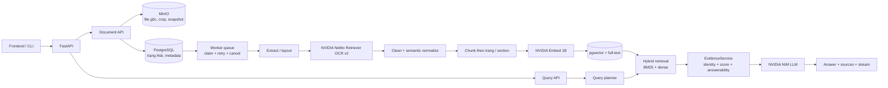
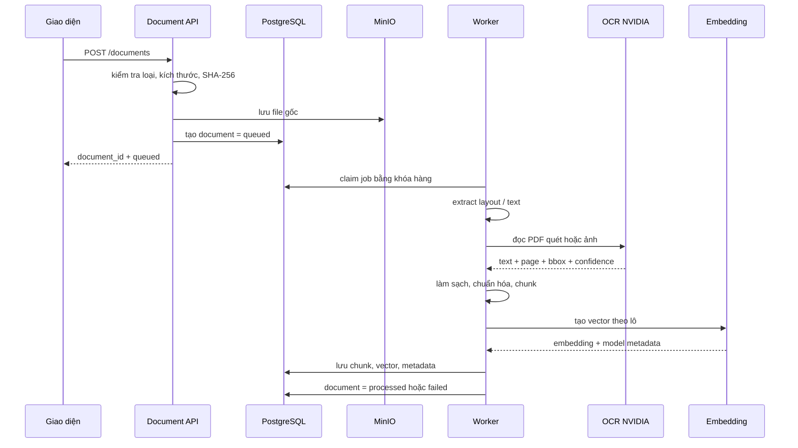
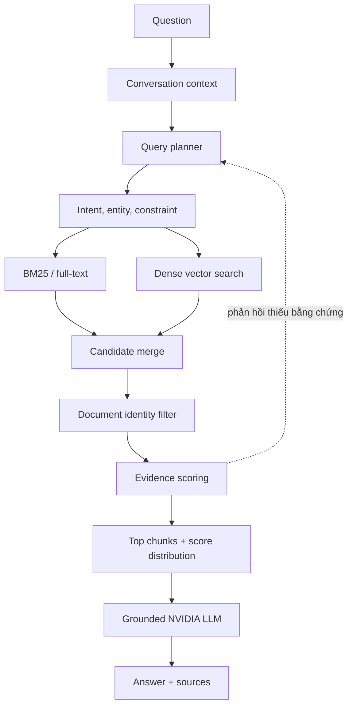

# Kiến trúc hệ thống Mini RAG

## 1. Mục tiêu kiến trúc

Hệ thống được thiết kế để biến tài liệu PDF, DOCX và TXT thành các đoạn bằng chứng có thể truy xuất. Câu trả lời chỉ được sinh sau khi hệ thống đã xác định tài liệu, xếp hạng đoạn phù hợp và gắn nguồn.

Kiến trúc tách bốn lớp:

1. **Giao diện:** tải tài liệu, đặt câu hỏi và nhận kết quả từng phần.
2. **API và điều phối:** kiểm tra yêu cầu, lập kế hoạch truy vấn, quản lý trạng thái và điều phối worker.
3. **Lưu trữ và xử lý nền:** lưu file gốc, metadata, vector và trạng thái job.
4. **Mô hình và truy xuất:** OCR, embedding, tìm kiếm kết hợp, xếp hạng bằng chứng và sinh câu trả lời.

## 2. Sơ đồ tổng thể

## 3. Luồng nạp tài liệu

### Quy tắc xử lý

- Tài liệu có lớp chữ được đọc trực tiếp; tài liệu quét hoặc ảnh được chuyển sang OCR NVIDIA.
- Kết quả OCR giữ số trang, hộp giới hạn và độ tin cậy để có thể kiểm tra lại.
- Chuẩn hóa không được làm mất ranh giới trang, tiêu đề, bảng hoặc phần chú thích.
- Embedding được tạo theo lô để giảm thời gian xử lý và tránh giữ toàn bộ tài liệu trong bộ nhớ.
- Job có thời gian chờ, thử lại và trạng thái lỗi; xóa tài liệu đang chạy sẽ hủy job trước khi xóa dữ liệu liên quan.

## 4. Luồng truy xuất và trả lời

### Nguyên tắc xếp hạng

- **Danh tính tài liệu** được lọc trước: Shopee không được trộn với Kamereo, Microsoft hoặc tài liệu bảo hành khác.
- **BM25** giữ các từ khóa phân biệt như NAPAS, GD100-PV, tên hãng và mã sản phẩm.
- **Dense search** bắt quan hệ ngữ nghĩa khi câu hỏi diễn đạt tự nhiên.
- **EvidenceService** chấm độ phù hợp chủ đề, thực thể, ràng buộc và khả năng trả lời.
- Chỉ những đoạn đạt ngưỡng và nằm trong phân bố điểm hợp lý mới được đưa vào context.
- Nếu không có bằng chứng đủ mạnh, hệ thống trả trạng thái thiếu dữ kiện và không tự dựng nguồn.

## 5. Mô hình và thành phần

| Thành phần | Công nghệ / mô hình | Vai trò |
|---|---|---|
| API | FastAPI | Xác thực dữ liệu, upload, query và streaming |
| File gốc | MinIO | Lưu PDF, DOCX, TXT, crop và snapshot |
| Cơ sở dữ liệu | PostgreSQL + pgvector | Lưu trạng thái, metadata, chunk và vector |
| Trích xuất | Docling | Đọc văn bản, bố cục và tài liệu Office |
| OCR | NVIDIA NeMo Retriever OCR v2 | Đọc bản quét, ảnh, bảng và vùng chữ |
| Embedding | NVIDIA NeMo Retriever Embed 1B | Tạo vector cho câu hỏi và chunk |
| Chuẩn hóa | Mô hình ngôn ngữ qua NVIDIA NIM | Chuẩn hóa tiêu đề, bảng và tín hiệu truy vấn có kiểm soát |
| Sinh câu trả lời | NVIDIA NIM | Tổng hợp câu trả lời từ evidence đã chọn |
| Xử lý nền | PostgreSQL queue | Claim job, retry, timeout và hủy job |
| Giao diện | React + Vite + Nginx | Kho tài liệu, chat và hiển thị nguồn |

## 6. Metadata và nguồn

Mỗi chunk tối thiểu lưu `document_id`, `chunk_id`, `file_name`, `content`, `embedding_model`, `created_at`. Metadata bổ sung gồm `chunk_index`, `page_start`, `page_end`, `section`, `chunk_type`, `extraction_method`, `ocr_confidence`, `source_locator`, `element_ids` và thông tin crop nếu có.

API hỏi đáp luôn trả `answer` cùng `sources`. Mỗi source trỏ về tài liệu, chunk và vị trí trang đã được chọn trước khi gọi mô hình; mô hình không được tự đặt tên nguồn.

## 7. Cấu hình và vận hành

Các tham số kết nối, mô hình, kích thước chunk, độ chồng lấn, số lượng kết quả, ngưỡng tương đồng, thời gian chờ OCR/NIM và số lần thử lại được đọc từ biến môi trường hoặc tệp cấu hình mẫu. Vì vậy thay đổi mô hình hoặc thông số truy xuất không cần sửa mã nghiệp vụ.

## 8. Giới hạn và hướng tiếp theo

- Hybrid retrieval và xếp hạng hiện là luật xác định; có thể bổ sung cross-encoder học từ phản hồi.
- Chỉ mục hình và annotation độc lập chưa bật cho mọi tài liệu vận hành.
- Cần thêm kiểm thử hồi quy cho danh tính tài liệu và score distribution trên dữ liệu production.
- Cần theo dõi độ trễ, tỷ lệ OCR dự phòng và tỷ lệ truy vấn không có bằng chứng.
